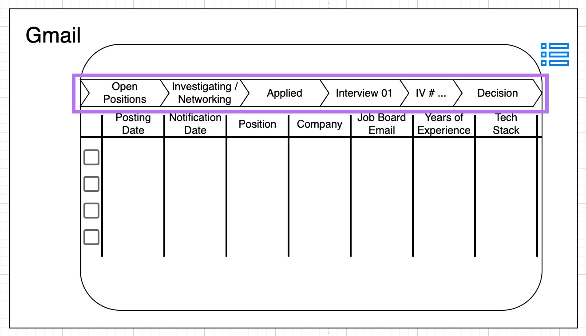

# Wireframes

## Gmail Integration

### Navigating To The Dashboard

- Clicking the icon in the right sidebar of Gmail will navigate the User to the dashboard screen of the program
- The dashboard itself is broken into two main sections: 
  - A "stages" bar
  - A "table" section

### Dashboard - Stages

- Ideally, the "stages" bar will also contain a count of all the records that are presently assigned to that stage
- Clicking on one stage or multiple stages will allow the user to filter their view to show only those records in the table that are assigned to those "active" stages, allowing the User to visualize and show only those job postings / applications in a particular stage
- As a default (first use), all stages will be open
- If a User sets a filtered view with only certain stages active, the platform should retain that information upon next opening allowing the user to "pick up where they left off"
- The "stages" would initially be defined as...

| Stage | Description |
| --- | --- |
| `Open Positions` | A position in this stage has been automatically parsed from a job board email |
| `Investigating / Networking` | A position is manually moved to this stage by a User; this is the stage where a User might set up networking meetings or do more research about a role before actually applying |
| `Applied` | A position is automatically moved to this stage by receipt of a confirmation email or manually moved to this stage by the User if a confirmation email is not part of the employer's application process |
| `Interview 01` | A position is automatically moved to this stage by the program upon receipt of a calendar invite |
| `Interiew # ...` | As the number of interviews differs on a by company / by role basis, there will be several columns that will serve as milestones within a candidate's pipeline; just like with the prior stage, the record will automatically be moved to the next interview stage by the program upon receipt of a new calendar invite |
| `Decision` | A position is automatically moved to this stage by the program upon receipt of either an "offer letter" congratulatory email or "thanks but no thanks we'll keep you in our records" email |

- Stage migrations are primarily automatic and will be determined based on some combination of the parsed domain of the email that's sent, the full email address of the sender, the contents of the email, the type of the email (i.e. calendar invite), etc.  

### Dashboard - Table

- The "table" will allow Users to be able to see all of the job postings they've received in their inbox, with various data points that they can filter / search by
- The "table" can be filtered to display / not display by clicking the appropriate stage / multiple stages in the pipeline bar
- The "table"'s column titles will allow the User to further filter their results as well (like the "Filter" view in an Excel spreadsheet) 

**Data Points To Surface**

| Data Point | Description |
| --- | --- |
| `Posting Date` | The actual date that the job was posted to the internet |
| `Notification Date` | The date the User received the email from the job board about the posting |
| `Position` | The title of the position that was shared in the email |
| `Company` | The company where the job posting will be employed that was shared in the email |
| `Job Board Email` | The job board that sent the email notifying the User of the position |
| `Years of Experience` | The requested years of experience extracted / parsed from the job description |
| `Tech Stack` | The list of softwares that were extracted / parsed from the job description |

- The `Posting Date` might be difficult to procure, but all of the other data points should be relatively simple - worst case there could be null values for some records in this column
- Optional values could be added to the dashboard based on what we define / determine as important for an "at a glance" of the position; these might include:

**Optional Data Points To Surface**

| Data Point | Description |
| --- | --- |
| `Minimum Salary` | The minimum salary currency value extracted / parsed from this job description |
| `Maximum Salary` | The maximum salary currency value extracted / parsed from this job description |

### Navigating To A Specific Record From The Dashboard

- Clicking a checkbox, or some other clickable part of a record, will redirect the User to further details about the specific posting as gleaned from the email they've received.
- The "record" view of an individual record has potentially four "widgets" which allow the User to view salient details about a posting at a glance, along with menu bar navigation to get to other details as they would like.

### Individual Record View

- Clicking the "Back" arrow will send the User back to their "Dashboard" view

- There are several menu items that could be included on this bar; the one button that should be present however is the "Generate Application Materials" button which would kick off the generation of a tailored Resume / Cover Letter based on the job posting itself; this should be placed as close to "window center" (far right) of the menu bar as possible.
- The menu buttons would change the "Parsed Job Description" widget pictured above
- Other Menu items could include:

| Menu Item | Description |
| --- | --- |
| `History` | A complete timeline in reverse chronological order of every action taken on this record as recorded by the User or by email correspondence about the posting |
| `Minutes` | A list of all recorded notes the User took related to the position |
| `Job Description` | A scrollable text of the parsed job description that the User can read to determine if they want to apply |

- The "Parsed Job Description" widget would contain a scrollable viewport to read the parsed job description

- The "Title" widget contains the Role Title, Company, and present Stage of the record within the User's job search pipeline
- By clicking the "Stage" area within the "Title" widget, the User can manually move the record to a different stage within their pipeline if they so choose

- The "Details" widget will contain the "at-a-glance" information that is important to the User which would include the information readily available within the "Dashboard" view
- This section could also include information like the company's website, LinkedIn, Twitter, contact information for the main point of contact about the role (or all contacts the User has interacted with about the role)

- The "Mini-Inbox" widget is, at present, a kind of "throwaway" space. I wasn't really sure what to place here and thinking only a little about it, a mini-inbox containing the most recent communications with the employer made sense